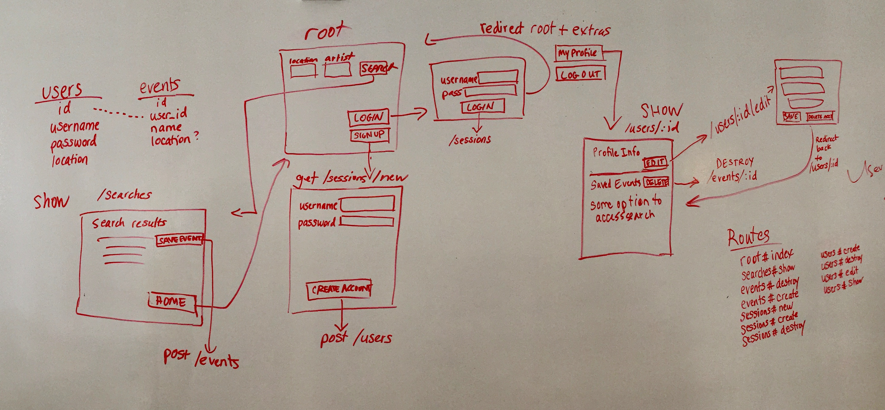
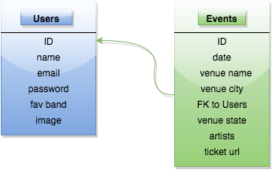

#WDI Project Three - Group Project

##Description
Objective is to create a concert application that allows users to find upcoming events in their area, save those events to their account, access a Google Map and receive a welcome email after registering.  This project will use the following technologies:
Ruby on Rails, HTML, Foundation CSS Framework, JamBase API, Google Maps API, PaperClip

**Team Members:**
Riaz Bacchus, Katerina Burshteyn, Heather Kemp, David Nash

The Project Trello Board Link: https://trello.com/b/kaaEYn0j

**Link to App on Heroku:** https://quiet-ridge-3116.herokuapp.com/

##Artifacts

####User Stories
Users Can Do the Following:
* 1. Search for music events by zip code.
* 2. Search for music events by artist
* 3. Create a login account to save search favorites.
   Log In/Out (sessions)
* 4. Receive a welcome email after creating an account.  
* 5. View event details, which includes links to purchase tickets and a google map.

####Front-end Wireframes

####Routes
get '/' events#index 
get '/sessions/new'  sessions#new 
post '/sessions'  session#create 
delete '/sessions/:id' sessions#destroy 
post '/users'  users#create 
get '/users/new'  users#new 
get '/users/:id/edit' users#edit 
get '/users/:id'  users#show 
put '/users/:id'  users#update 
delete '/users/:id'  users#destroy 
get '/events/:id'  events#show 
post '/events/search/location'  events#search_location 
post '/events/search/artist'  events#search_artist 
get '/events/search/:id'  events#search_id 
post '/events'  events#create 
delete '/events/:id'  events#destroy 

####Database Design

